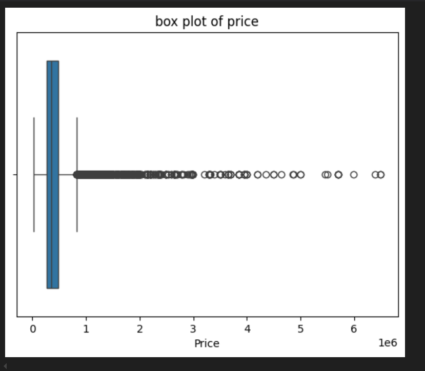
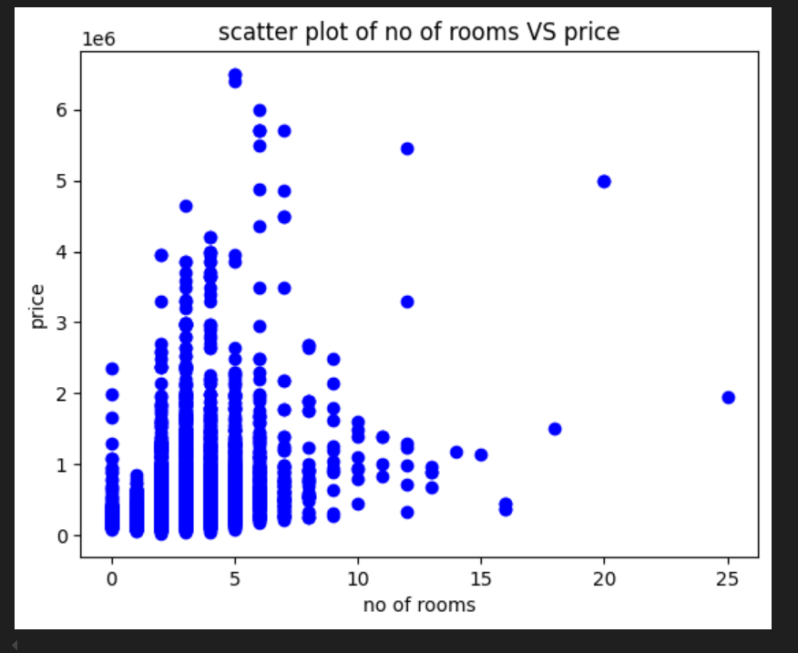
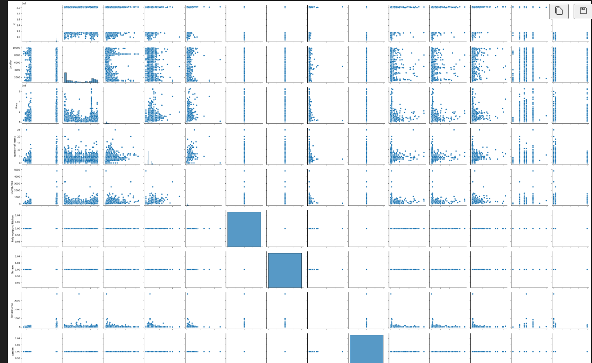

# Immo-Eliza-project-Data analysis

## Table of Contents

- [Description](#description)
- [Installation](#installation)
- [Usage](#usage)
- [Visuals](#visuals)
- [Contributors](#contributors)
- [Structure](#structure)
- [Timeline](#timeline)

## Description

This is the second stage of a larger project to Cleaning and doing a complete analysis and interpretation of the dataset created during the previous challenge. In order to create a machine learning model to predict prices on Belgium's real estate's sales.
The Python-based tool uses unclean_data.csv file and cleaned_data.csv file

## Installation

-Clone the repository: `` git clone https://github.com/elsagk/Immo-Eliza-data-analysis`

-Install dependencies:
-.Python 3.12.7

-.pip install pandas matplotlib

      -Version: name-Pandas 2.2.3  name- Matplotlib 1.16.0

## Usage

-Retrieve a list of properties from the HTML page source of the website.

-Extract poperties' information from immoweb for each property.

-Save the output in a CSV file which could be used for related analysis.

## Visuals

## Contributors

https://github.com/elsagk

## Timeline

This stage of the project lasted 3 days in the week of December 02, 3:30PM.
